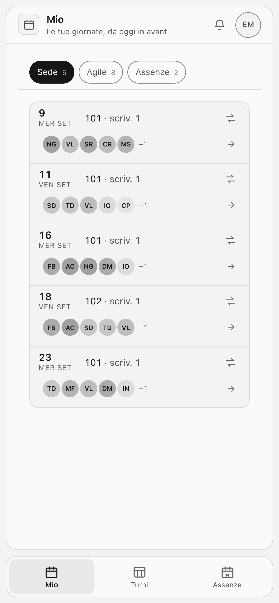
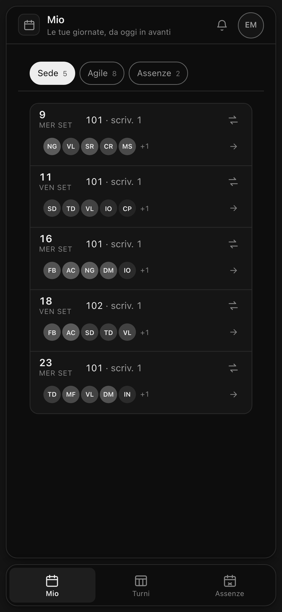
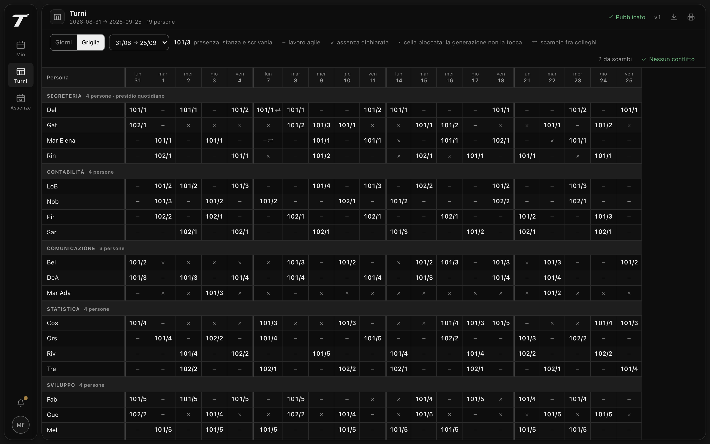

<p align="center">
  
</p>

<h1 align="center">Turni</h1>

<p align="center">
  <em>Sai sempre quando sei in sede, e con chi.</em>
</p>

<p align="center">
  Programmazione dei turni fra sede e lavoro agile per uffici pubblici:<br>
  entro le scrivanie che esistono davvero, senza mai rivelare perché un collega non c'è.
</p>

<p align="center">
  
  
  
  
  
</p>

<p align="center">
  
  &nbsp;&nbsp;
  
</p>



---

<details>
<summary><strong>Indice</strong></summary>

- [Il problema](#il-problema)
- [Cosa fa](#cosa-fa)
- [Avvio in locale](#avvio-in-locale)
- [Privacy per costruzione](#privacy-per-costruzione)
- [Misurato, non sperato](#misurato-non-sperato)
- [Com'è fatta](#comè-fatta)
- [Verifiche](#verifiche)
- [Rilascio](#rilascio)
- [Documentazione](#documentazione)
- [Contribuire](#contribuire)
- [Stato](#stato)
- [Licenza](#licenza)

</details>

## Il problema

Un ufficio con più persone che scrivanie deve decidere, ogni settimana, chi
viene e chi resta a casa. Si fa con un foglio di calcolo, finché non ci si
accorge che il foglio non sa quante scrivanie ci sono, non sa chi è in ferie,
non impedisce a un intero settore di sparire lo stesso giorno, e soprattutto
mostra a tutti la causale dell'assenza di ciascuno.

Turni fa quel lavoro sapendo tutte e quattro le cose.

## Cosa fa

- **Programma per periodi** — una settimana, un mese, quattro settimane. Bozza,
  approvazione del dirigente, pubblicazione, versioni conservate per intero.
- **Genera una proposta** e la lascia correggere. Le celle bloccate a mano
  sopravvivono a ogni rigenerazione.
- **Non supera mai la capienza**: la capienza di una stanza è il numero di
  scrivanie attive, non un numero scritto da qualche parte che qualcuno deve
  ricordarsi di aggiornare.
- **Copre i settori a presidio** prima di distribuire il resto.
- **Assenze dichiarate dagli interessati**, anche ricorrenti, anche su
  programmazioni già pubblicate. Il calendario pubblicato non si riscrive da
  solo: chi organizza viene avvisato.
- **Scambio di turni fra colleghi** senza passare da nessuna approvazione, ma
  solo dove i conti tornano: presidio, postazioni, limiti di lavoro agile.
- **Stampa** su carta o PDF: griglia del periodo, giorno per giorno, calendario
  personale, occupazione delle stanze.
- **Notifiche** in applicazione e push del browser. Nessuna posta elettronica.
- **Funziona senza rete**: installata sul telefono, apre le tue giornate anche
  in garage, dicendo a quando risalgono. Delle giornate conservate ci sono solo
  le proprie, e uscendo si cancellano.
- **Fatta per il telefono quanto per il monitor**: scala tipografica propria
  sotto i 640px, bersagli da polpastrello, giorni che si sfogliano col dito e
  vibrazione di conferma dove il sistema la offre.

## Avvio in locale

Serve Node 20 o successivo e un MySQL 8 (o MariaDB) in ascolto.

```bash
# 1. database
mysql -u root -e "CREATE DATABASE turni CHARACTER SET utf8mb4 COLLATE utf8mb4_unicode_ci"

# 2. configurazione
cp .env.example .env      # compila DATABASE_URL e SEED_PASSWORD

# 3. dipendenze e schema
npm install
npm run migra

# 4. dati di prova
npm run seed

# 5. API su 8787, interfaccia su 5173 con proxy verso l'API
npm run dev
```

Le utenze di prova hanno tutte la password indicata in `SEED_PASSWORD`, e nomi
inventati: `admin@turni.test` per l'amministratore, `marco.fab@turni.test` per
l'organizzatore, `serena.fer@turni.test` per il dirigente, ogni altra
`nome.sig@turni.test` per i dipendenti.

Il popolamento di prova **si rifiuta di girare** con `NODE_ENV=production`, e
anche se trova in archivio un solo indirizzo fuori dal dominio di prova.

## Privacy per costruzione

Non è una sezione di conformità: sono scelte che hanno cambiato il codice.

**Dell'anagrafica entra solo ciò che serve a fare i turni.** Nome, cognome,
indirizzo, unità e settore: nessun codice fiscale, nessuna matricola, nessun
dato contrattuale, nessuna data di nascita. Negli elenchi compare il solo
cognome, e il nome si aggiunge alle sole righe che altrimenti si
confonderebbero in quella schermata.

**Un collega non distingue un assente da chi lavora da casa.** Il mascheramento
avviene in un punto solo del server, prima della serializzazione, e nessuna
causale attraversa quella funzione senza titolo. Anche l'export CSV lo rispetta.

**Le esclusioni non si spiegano.** Quando cerchi qualcuno con cui scambiare un
turno, chi non compare non compare e basta: assenza, postazioni esaurite,
presidio, limiti settimanali e proposte già aperte escludono allo stesso modo.
Una motivazione racconterebbe di terzi ciò che non ti riguarda.

**L'amministratore di sistema non vede nessuna programmazione.** Censisce unità
e utenti. Non è una limitazione dell'interfaccia: le rotte rispondono 403.

## Misurato, non sperato

| | |
|---|---|
| Accessibilità | **nessuna violazione WCAG 2.1 AA** — axe-core su 9 pagine × 2 temi × 2 schermi |
| Contrasto dei token | calcolato dai file CSS in entrambi i temi, non valutato a occhio |
| Rotte API | mediana **3–10 ms**, la più pesante 51 kB → **2,7 kB** compressi |
| Motore, 1000 persone | **81 ms** per 21 giornate lavorative |
| Pagina, 4G scarsa | primo testo **390 ms**, elemento più grande **880 ms**, scarti di impaginazione **0.000** |
| Primo caricamento di «Mio» | **212 kB** compressi, di cui **92 kB** di caratteri self-ospitati |

Ogni riga è prodotta da uno strumento che si riesegue, non da una stima:
axe-core su Chrome headless, i tempi misurati sulle rotte vere, il motore
lanciato su archivi sintetici fino a mille persone, il peso sommato dai file
che escono dalla build. `npm run carico` sta nel repository; il resto della
strumentazione vive fuori, insieme al materiale di rilascio.

## Com'è fatta

```
web/     SPA React 19 + Vite + Tailwind v4, compilata in file statici
server/  API Hono su Node, Drizzle ORM su MySQL 8 / MariaDB
docs/    manuale d'uso
```

Nella radice c'è solo quello che serve a far girare l'applicazione. Strumenti
di misura, materiale di rilascio e design system di riferimento stanno fuori
dal repository.

Un processo solo serve l'API e il frontend compilato: sull'hosting serve un
solo slot applicativo. Tutto si compila prima del rilascio — il server in un
file solo con esbuild, il frontend con Vite — e in produzione gira JavaScript,
non TypeScript interpretato a ogni avvio.

Alcune scelte che meritano una riga:

- **La capienza non è un campo**, è il conteggio delle scrivanie attive.
- **Un'unità ha un dirigente solo**, e a garantirlo è un indice unico su una
  colonna generata, non un controllo nel codice.
- **Una giornata in scambio non entra in un secondo scambio**: stesso trucco,
  due colonne generate che si spengono da sole quando la proposta si chiude.
- **Il motore è deterministico**: stessi ingressi, stesso risultato. Rigenerare
  non rimescola le carte.
- **Niente CDN, niente caratteri remoti, niente analitica.** La politica dei
  contenuti può dirlo perché è vero: nessun dato del personale raggiunge terzi.

L'interfaccia segue un design system a **isole neutre**: palette monocromatica
in OKLCH, il colore riservato agli stati, rail a sinistra da tablet in su e
barra in basso sul telefono. I token stanno in
[`web/src/styles/tokens.css`](web/src/styles/tokens.css); le correzioni di
contrasto che il design system non copriva stanno in
[`app.css`](web/src/styles/app.css), con la misura accanto.

Il movimento è parte del design system, non decorazione: si animano solo
`opacity` e `transform` — le due proprietà che il compositor muove senza rifare
il layout — e a farlo rispettare c'è un test che legge i fotogrammi chiave.

## Verifiche

```bash
npm test          # 229 test: motore, permessi, scambi, nomi, contrasti, telefono, movimento
npm run verifica  # 13 criteri di accettazione contro un'istanza avviata
npm run carico    # motore fino a 1000 persone
npm run build     # controllo dei tipi e build di produzione
```

I 229 girano ovunque. Altri sette — caricamento ed esportazione — parlano con
il database di prova: senza `DATABASE_URL` nel `.env` quei due file si fermano
prima di partire, e il conto si ferma a 229.

Le verifiche che parlano con un browser — accessibilità, tempi di
caricamento, schermate — pilotano Chrome headless dal protocollo di sviluppo,
senza Puppeteer né Playwright: un file, zero dipendenze. Stanno fuori dal
repository con il resto della strumentazione.

## Rilascio

Il rilascio è un archivio di circa 1 MB: server, frontend già compilato,
configurazione da riempire. Fuori restano test, popolamento di prova,
strumenti di misura e ogni traccia di dati del personale. Tutto si compila
prima, non sul server: su un piano condiviso la compilazione è il punto in cui
ci si arena.

Sul server: `npm install --omit=dev`, il `.env`, `npm run migra`, e
`npm run avvio -- persone.csv` la prima volta — che crea le utenze reali e
stampa una volta sola una password diversa per ciascuno. Il resto delle
tabelle si carica con `npm run importa`, a partire dai
[modelli](docs/modelli/).

## Documentazione

- [Manuale d'uso](docs/MANUALE.md) — per tutti, con le parti dedicate a
  dirigenti, organizzatori e amministratore.
- [Modelli di caricamento](docs/modelli/) — sei file CSV, uno per tabella:
  persone, stanze, settori, assenze, causali, giornate non lavorative. Si
  aprono con un foglio di calcolo, e `--prova` li verifica senza scrivere.

## Contribuire

Le segnalazioni e le proposte sono benvenute. [CONTRIBUTING.md](CONTRIBUTING.md)
dice in due pagine come è scritto il codice — commenti in italiano, che
spiegano il perché e non il cosa — cosa deve passare prima di una proposta di
modifica, e le poche regole che i test fanno rispettare da soli.

## Stato

Prima versione completa e provata. Rinviato per scelta, non per dimenticanza:

- editor grafico delle planimetrie con trascinamento
- virtualizzazione della griglia oltre le 200 righe — sopra quella soglia il
  collo di bottiglia è il DOM, non più il server
- fasce orarie infragiornaliere e stanze condivise fra unità
- accesso con identità istituzionale e importazione dal sistema del personale

## Licenza

[MIT](LICENSE). Prendi, usa, modifica, rivendi, senza chiedere niente a
nessuno. Qui dentro non c'è niente di inventato: un motore che riempie una
griglia rispettando dei vincoli, un modello dei permessi e un po' di cura nel
non far uscire i dati di nessuno. Se serve a qualcun altro, tanto meglio.
